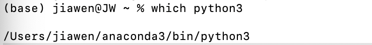
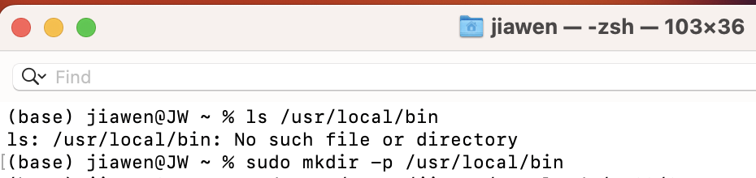
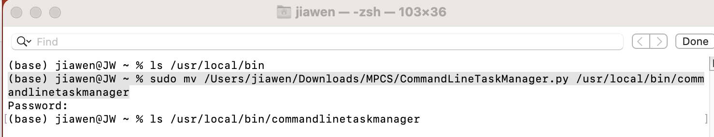
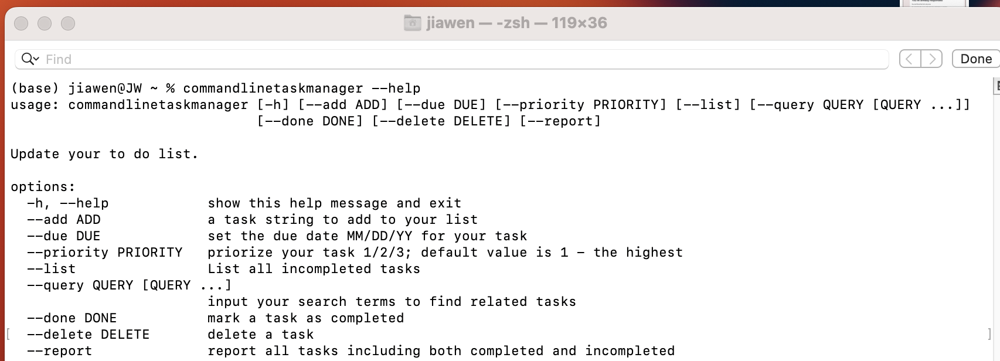
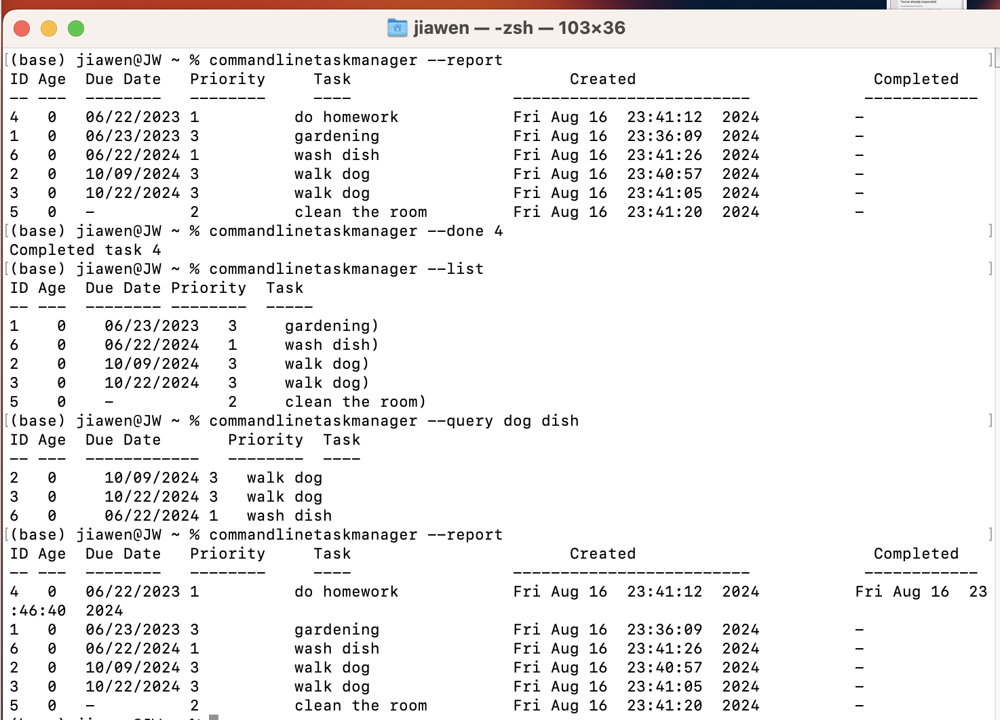

# FinalProject Extra Credit:
"""Make your task manager program an executable program. Allow it to be run from any location on your computer.  """

Steps:
1. add a Shebang line in the 1st line of my file 'CommandLineTaskManager.py'
#!/usr/bin/env python3
--> tell the system using the python3 to run the script

2. Check the environment with 'which python3':
Termial output:  /Users/jiawen/anaconda3/bin/python3

3. Check the directory ' /usr/local/bin ' , if not exit, create it
ls /usr/local/bin
sudo mkdir -p /usr/local/bin

4. 'chmod':
In the terminal, use 'chmod' to change the file permission & the running mode of the file, making it to be executable:
(base) jiawen@JW ~ % chmod +x /usr/bin/python3 /Users/jiawen/Downloads/MPCS/ConceptsOfProgramming/FinalProject/CommandLineTaskManager.py

5.  Move the Script to a Directory in $PATH:
(base) jiawen@JW ~ % sudo mv /Users/jiawen/Downloads/MPCS/CommandLineTaskManager.py /usr/local/bin/commandlinetaskmanager

(enter compurter password to authorize)

Then use 'ls' to check if the file is moved successfully: 
ls /usr/local/bin/commandlinetaskmanager

6. commandlinetaskmanager --help

7. Successfully Execute in Terminal & execution results screen cap.:

Example: add 
(base) jiawen@JW ~ % commandlinetaskmanager --add 'gardening' --priority 3 --due 23/06/2023
#2 commandlinetaskmanager --add "walk dog" --priority 3 --due 9/10/2024
#3 commandlinetaskmanager --add "walk dog" --priority 3 --due 22102024
#4 commandlinetaskmanager --add 'do homework' --priority 1 --due 22/06/2023
#5 commandlinetaskmanager --add 'clean the room' --priority 2
#6 commandlinetaskmanager --add 'wash dish' --priority 1 --due 22/06/2024

Example: checking other commands:  report, list, query, done 

